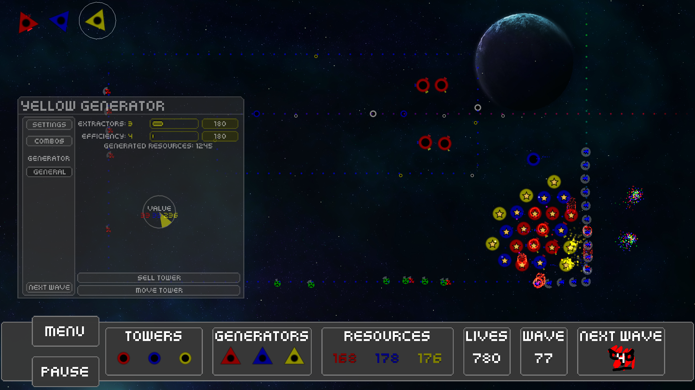

# Java
Split up into several categories, due to how many Java projects I've done.

## Plain Java
As in, programs that only use Java, and not any other libraries

#### Gift Exchange [Source Code](https://github.com/thepaperpilot/christmasExchange)

A program for creating psuedo-randomized gift exchanges with dynamic rules.

## Android

#### iCan [Source Code](https://github.com/brianqvpham/iCan)

Made in beautiful material design, this app efficiently and intuitively collects data from users on recycling habits and provides information about the impact they are having, as well as enabling users to directly compare their impacts to the each through social medias.

Made for HackTX 2015 in under 24 hours!

  

## libGDX
A java-based game engine, more information [on their website](https://libgdx.badlogicgames.com/)

#### Solar TD  [Store Page](http://thepaperpilot.itch.io/solar-td) [Source Code](https://github.com/thepaperpilot/SolarTD)

This was made in about a month for the LibGDX game jam!

The game takes a lot of inspiration from Onslaught TD, an old flash game. Now its in HTML5 and in space, with some other new mechanics.

There is no dev log, because over break I was focusing on family and only working on this in the down times. I didn't want to commit to documenting everything, apart from the commits themselves.

     

#### Space Game

Space Game is a game of mystery and discovery. You play the role of a scientist, who has found themselves in an endless loop of death and rebirth, with only your notes to link you to your previous experiences. As you play, your player writes everything you discover in a journal. So truly, survival is optional, as death is pretty meaningless. Instead, the game focuses on discovery and exploration, encouraging the player to try new things and experiment. From upgrading your ship to leveling up to making towers, every mechanic is built from the ground up to become progressively clearer. But beware, because, as the player learns, so do the enemies.

Space Game features an advanced note system around which everything else is based. Enjoy countless hours of experimenting and trying out new strategies, various guns, upgrades, and towers.

I stopped development on this because it became to big to work on for a single person, it went completely out of scope, fell victim to feature creep more times than I can count, etc. At the end I was working on making things easier for the player, and broke tower upgrades. I made the decision to keep the version that was nicer to use over the one with upgrades, since honestly it never needed upgrades. I'm still not satisfied with the state of the game, but oh well. Because of the mess that is the code base, this game is closed source.

      

### In development

#### Red Pen [Store Page](http://thepaperpilot.itch.io/red-pen) [Source Code](https://github.com/thepaperpilot/Red-Pen)

This is an RPG about a writer who sells their soul to the devil in exchange for extraordinary writing abilities.

There are 5 chapters planned. This game is currently in development. If you want to spoil yourself you can check out some of the planned plot points at github. It should be noted there are some things planned like some enemies expanding upon the core gameplay mechanic that do not appear in that document. You'll just have to wait and see!

Much of what else I'd like to say borders on spoiler territory. If you'd like to learn more see the [story.md](https://github.com/thepaperpilot/Red-Pen/blob/master/story.md) document on the github page, or look at [thoughts.md](https://github.com/thepaperpilot/Red-Pen/blob/master/thoughts.md) for what I currently am working on!

You can follow development in a telegram broadcast channel at [https://telegram.me/tppRedPen](https://telegram.me/tppRedPen)

#### The Fourth Order [Store Page](https://thepaperpilot.itch.io/fourth-order) [Source Code](https://github.com/thepaperpilot/fourth-order)

A game made in under 48 hours for UT Dallas' SGDA Spring 2016 Game Jam! A match-3 RPG, reminiscent of Puzzle Quest.

#### Necrio [Source Code](https://github.com/thepaperpilot/Necrio)

A casual strategy game where you resurrect your fallen foes

### Shelved Projects

#### Planet Farm [Store Page](https://thepaperpilot.itch.io/planet-farm) [Source Code](https://github.com/thepaperpilot/PlanetFarm)

Originally supposed to be a game, it's current state is more of a simulator.

Create and mutate and breed planets. Browse a collection of procedurally generated planets. To be honest it was really just a way for me to learn new things, dealing with 3D and moving cameras in 3D space, etc.

#### 12 is Strange [Store Page](http://thepaperpilot.itch.io/12-is-strange) [Source Code](https://github.com/thepaperpilot/12-is-strange)

This is a game made in under 48 hours for UT Dallas' SDGA Fall 2015 Game Jam!

I want to at some point flesh this out into an entire, original game (and less of a Life is Strange fan game)
