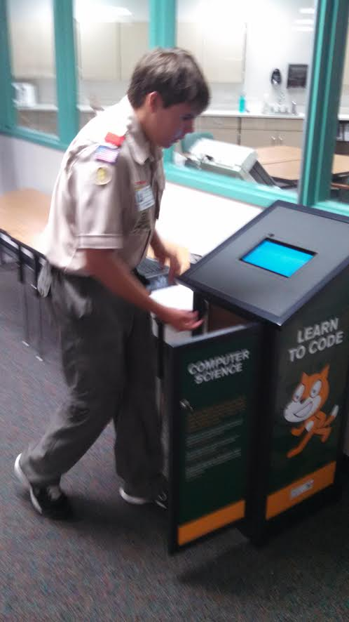
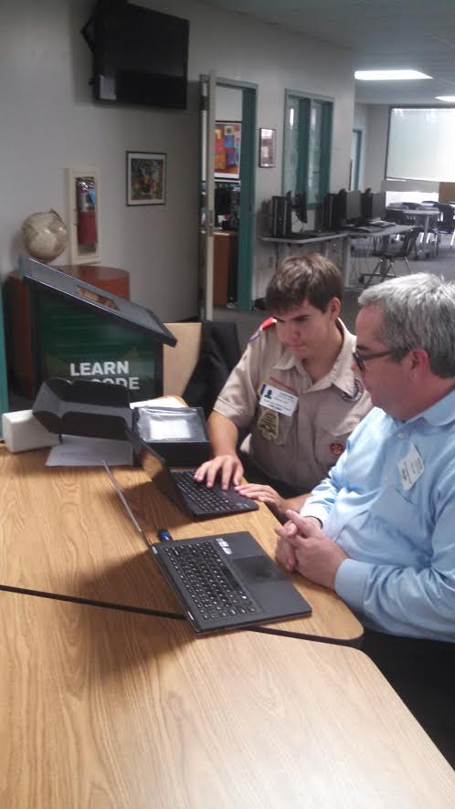
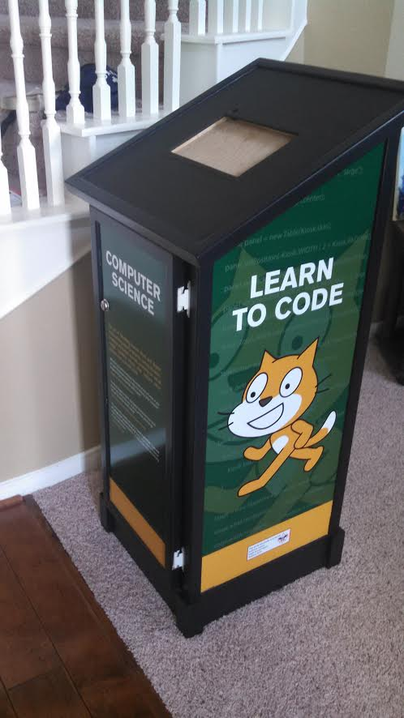
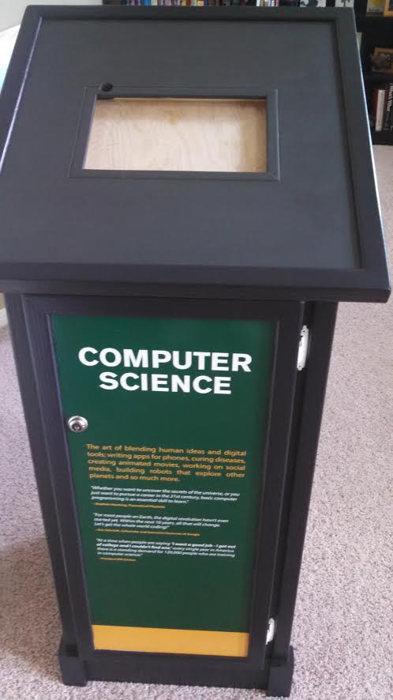
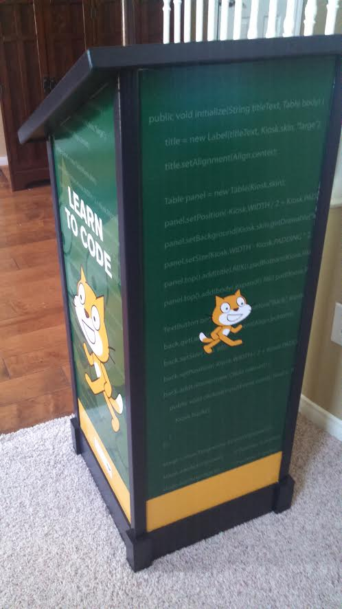

# Other
Miscellaneous projects, or things that deal with more than just a single programming language

#### Computer Science Kiosk [Source Code](https://github.com/thepaperpilot/Computer-Science-Kiosk)

This is an open source program for a kiosk that will teach students the basics of computer science. It was initiated as a part of Anthony Lawn’s Eagle Scout Project, which was to build such a kiosk to place in the Quail Valley Middle School library.

The kiosk uses Scratch as a teaching tool for students, and provides resources such as code.org that help interested students pursue Computer Science.

     
