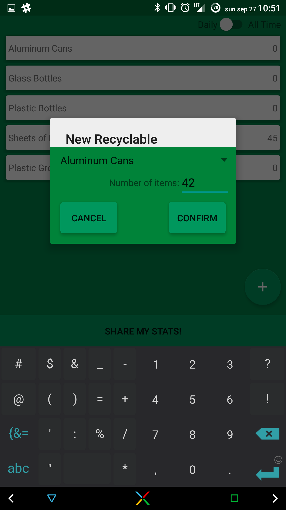

# iCan!

**[Source Code](https://github.com/brianqvpham/iCan)**

Made in beautiful material design, this app efficiently and intuitively collects data from users on recycling habits and provides information about the impact they are having, as well as enabling users to directly compare their impacts to the each through social medias.

Made for HackTX 2015 in under 24 hours!

