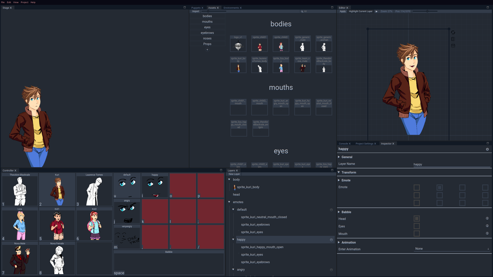
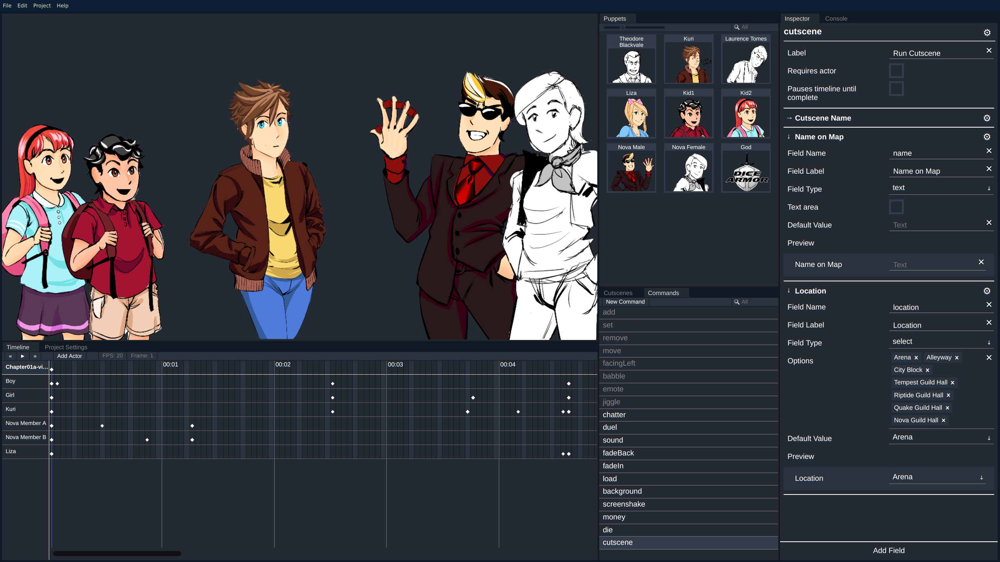

# Babble Buds

[Babble Buds Homepage](http://babblebuds.xyz/)

Source Code:
- [Babble Buds](https://github.com/thepaperpilot/Babble-Buds)
- [Babble Movie Maker](https://github.com/thepaperpilot/BabbleMovieMaker)
- [babble.js](https://github.com/thepaperpilot/babble.js)
- [babble.cs](https://github.com/thepaperpilot/babble.cs)

Babble buds is a free, open-source virtual puppet show software. It is heavily based on the non-public software called "Puppet Pals", used in URealms Live. The software is written in javascript using React, a rendering library called PIXI.js, and electron.

Users can create puppets with different faces for different emotions, and then use the puppet on a stage where you and other users can each make your respective puppets move, change emotions, and "babble" at each other. The stage has a green screen feature and can be popped out, which gives the users tons of possibilities in terms of using the program for a role-playing live stream, faux video chatting with friends, game development, or whatever else you want!

Users can connect to the public server and create private rooms so that they and their friends can see each other's puppets and use the software however they please. For the security conscious, you can also use the server's source code to self-host your private server.

## Engine

The engine originally made to make the Babble Buds program was separated into a separate engine called `babble.js`, so that projects created in Babble Buds can be used in other projects. For example, a game can create puppets in Babble Buds and then use them for cutscenes or player agency inside of the game. Additionally, it has been ported to C# (called `babble.cs`) for use with Unity, for the same kinds of purposes. You can check out [Tower Offense](https://thepaperpilot.itch.io/tower-offense) for a pixi.js game using Babble Buds puppets for the cutscenes, or [Dice Armor](../dice) for a unity game using Babble Buds puppets for the cutscenes.

## Babble Movie Maker

Babble Movie Maker is a cutscene editor for Babble Buds puppets. You open a babble buds project in it, and you can add actors to a stage and have them move and change expressions, etc., on a timeline. You can then use the cutscene in a game using `babble.js` or `babble.cs`, or export the cutscene into a video file. There is even support for defining custom commands with custom fields, so that if you've expanded upon the default actions provided in `babble.js` or `babble.cs`, you can still use Movie Maker to create your cutscenes.

