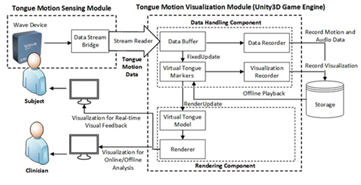
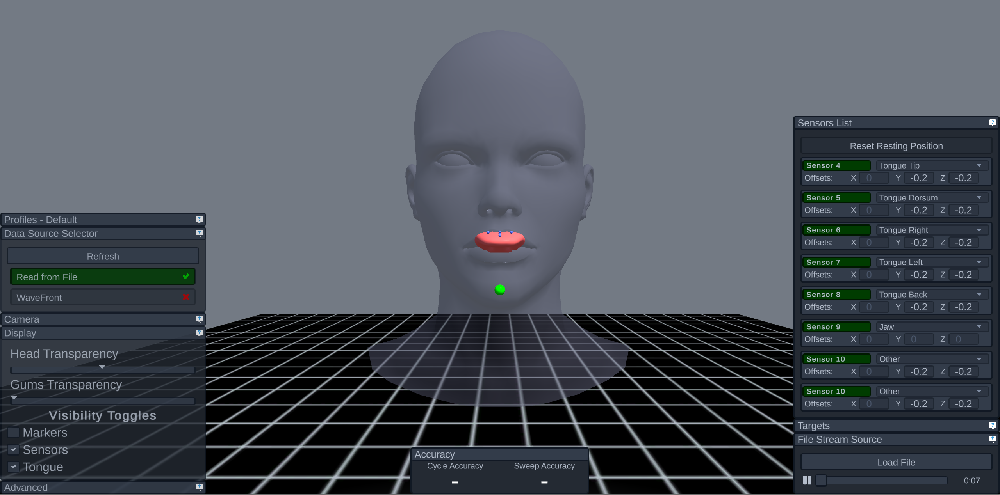
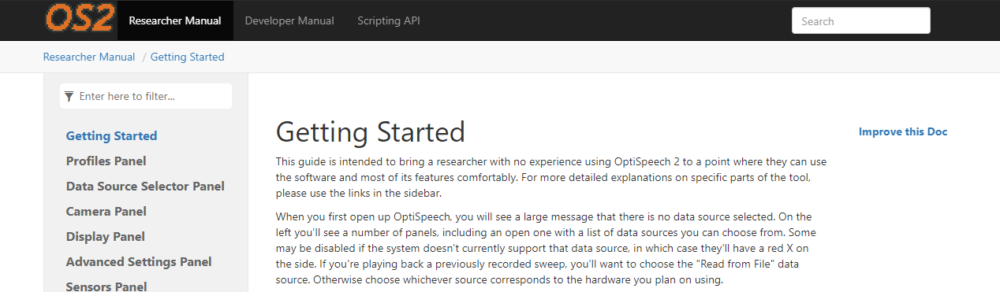
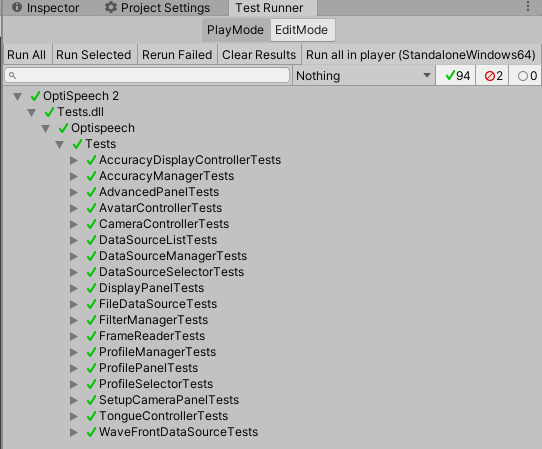

# OptiSpeech

The Optispeech project involves designing and testing a real-time tongue model that can be viewed in a transparent head while a subject talks — for the purposes of treating speech errors and teaching foreign language sounds. This work has been conducted in partnership with Vulintus and with support from the National Institutes of Health (NIH). The UT Dallas Speech Production Lab is currently updating the program to use updated versions of Unity and adding support for more features and hardware.

<iframe width="560" height="315" src="https://www.youtube.com/embed/9uHqIRs7ZjM" frameborder="0" allow="accelerometer; autoplay; clipboard-write; encrypted-media; gyroscope; picture-in-picture" allowfullscreen style="display: block; margin: auto;"></iframe>

This video shows a talker with WAVE sensors placed on the tongue hitting a virtual target sphere located at the alveolar ridge. When an alveolar consonant is hit (e.g., /s/, /n/, /d/) the sphere changes color from red to green.

<iframe width="560" height="315" src="https://www.youtube.com/embed/Oz42mKvlzqI" frameborder="0" allow="accelerometer; autoplay; clipboard-write; encrypted-media; gyroscope; picture-in-picture" allowfullscreen style="display: block; margin: auto;"></iframe>

This video shows an American talker learning a novel sound not found in English. When the post-alveolar consonant is hit, the target sphere changes color from red to green. Here, the NDI WAVE system serves as input.

The program is being updated by a team in the UT Dallas Speech Production Lab led by Anthony Lawn, so the program uses a more modern version of Unity, has an easier-to-use interface, can more easily support new features, and can connect to additional EMA systems, namely the Carstens AG501.

In addition, the program now includes documentation and unit tests to improve program stability and maintainability going forward.

