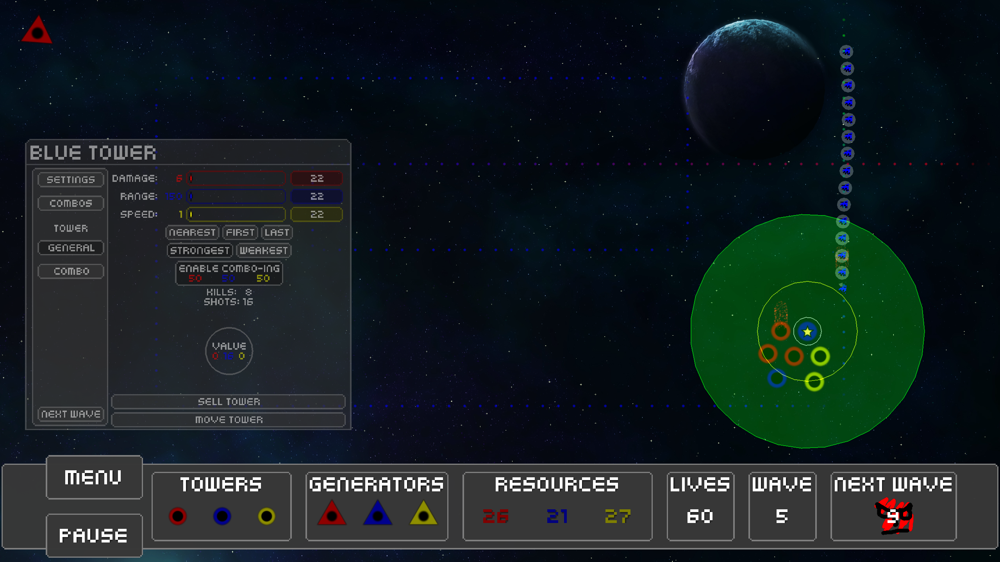

# Solar TD!

This was made in about a month for the LibGDX game jam!

The game takes a lot of inspiration from Onslaught TD, an old flash game. Now its in HTML5 and in space, with some other new mechanics.

There is no dev log, because over break I was focusing on family and only working on this in the down times. I didn't want to commit to documenting everything, apart from the commits themselves.

The game can play in your browser, and will if you go to the store page below.

[Store Page](http://thepaperpilot.itch.io/solar-td)

[Source Code](https://github.com/thepaperpilot/SolarTD)

  
  
  
  
  
  

