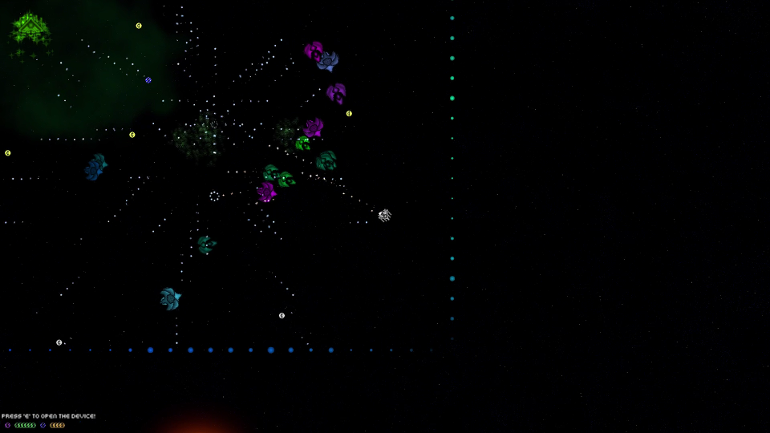

# Space Game!

Space Game is a game of mystery and discovery. You play the role of a scientist, who has found themself in an endless loop of death and rebirth, with only your notes to link you to your previous experiences. As you play, your player writes everything you discover in a journal. So truly, survival is optional, as death is pretty meaningless. Instead, the game focuses on discovery and exploration, encouraging the player to try new things and experiment. From upgrading your ship to leveling up to making towers, every mechanic is built from the ground up to become progressively clearer. But beware, because, as the player learns, so do the enemies.

Space Game features an advanced note system around which everything else is based. Enjoy countless hours of experimenting and trying out new strategies, various guns, upgrades, and towers.

[Store Page](http://thepaperpilot.itch.io/space-game)

[Video Trailer](https://youtu.be/L7LPhxCTn2Y)

  
  
  
  
  
  
  

